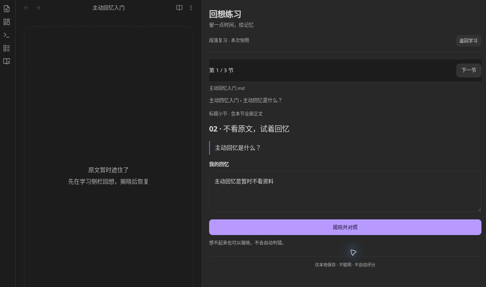
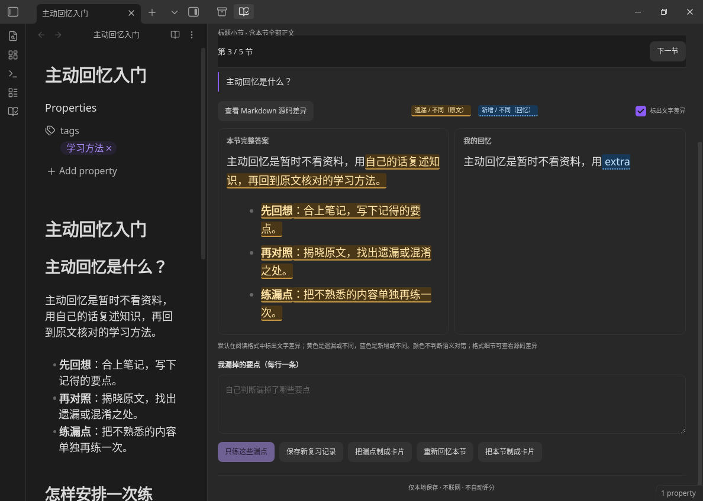
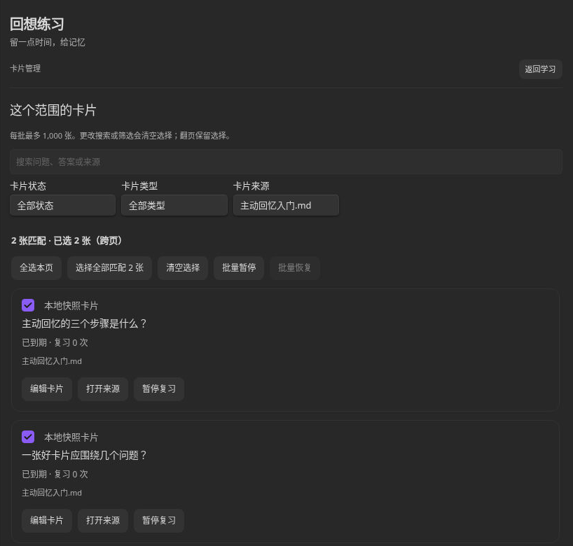
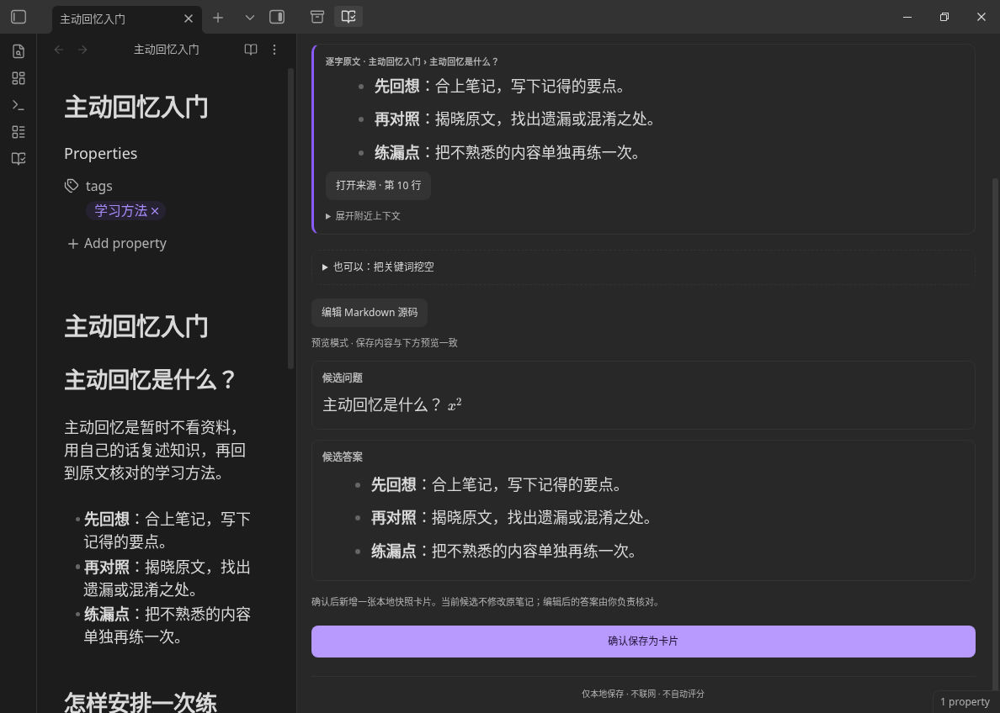

# 回想练习 · Passage Practice

把 Obsidian 笔记变成日常回忆练习：看题目、回想、揭晓原文，再把容易忘的内容做成卡片。

适合用笔记备考、学习课程或积累专业知识的人。中文界面，练习在侧栏完成；仅支持桌面版。当前版本 **1.5.1**，使用本地规则，无需 API Key。

## 四种学习方式

### 段落复习：记住一节内容

以最底层标题作题目，标题下的完整一节作参考答案，不按空行拆题。先回忆，再点「揭晓并对照」核对；可以记下漏点，只练漏掉的部分，或把本节制成卡片。揭晓时左侧笔记同步定位到对应正文；可按「上一节／下一节」连续复习。没有标题的笔记也能按全文练习，还可以在编辑器中选一段文字单独练。

先遮住原文，在侧栏写下记得的内容。

揭晓后，把完整答案和自己的回忆放在一起核对。默认保留 Markdown 阅读格式，黄色标出原文中遗漏或不同的文字，蓝色标出回忆中新增或不同的文字；也可关闭高亮或切换源码差异。颜色仅提示文字差异，不判断语义对错。

本轮切换上一节、下一节时会保留临时草稿；「重新回忆」会重置本节。返回学习、关闭或隐藏侧栏后，未保存的草稿会清除。需要留存时，可在对照后保存为新的复习记录，不改动来源笔记。

### 大纲回忆：记住知识结构

看父节点，回忆它有哪些直属子分支，然后逐项揭晓、继续深入下一层。支持 Markdown 多级标题和缩进列表，适合复习章节框架、分类与步骤；不自动总结正文，也不读取图片思维导图。

### 问答卡片：安排间隔复习

正面是问题，背面是答案。揭晓后自己选择「忘了／困难／记住了／轻松」，插件据此安排下次复习，不自动判分。「开始复习」与「新建卡片」位于页面顶部，方便直接开始。

用「新建卡片」独立保存卡片。卡片内容、卡组关联、调度状态和真实评分日志保存在知识库的 `Passage Practice/state.json`，来源 Markdown 始终只读；已有 `practice-card` 标记仍可读取和复习。卡片快照不会随原文修改而更新。从选段、整节、漏点或候选制卡时会保留来源原文，编辑卡片或挖空后仍可核对；来源变化或旧卡缺少定位依据时，会提示你手动检查。

「管理卡片」支持按状态、类型、来源筛选与搜索，也能跨页选择、核对后批量暂停或恢复；暂停不会清除已有进度。

按来源筛选卡片，再选择需要暂停或恢复的项目。

#### 选择复习算法

打开 Obsidian「设置 → Passage Practice」，页面标题为「回想练习」，在「复习算法」中选择：

- **FSRS · 记忆模型**：使用 Open Spaced Repetition 官方 ts-fsrs 5.4.2（FSRS-6），目标记忆率 90%，采用官方学习与重学步骤
- **Spaced Repetition · 按天**：使用 SM-2-OSR 默认公式，按本地日期计算到期。新卡选择「忘了」今天到期，「困难」1 天、「记住了」3 天、「轻松」4 天后到期

切换算法只保存偏好，不重排现有到期时间。每张卡片下次实际评分时才开始所选算法的新调度阶段，已有评分历史和累计复习次数保留；再次切回也会建立新的调度起点。

默认每轮每张卡片只出现一次。可在侧栏学习选项中启用「本轮结束后，再练一次『忘了』且已到期的卡片」；每张最多追加一次，不提前练未到期卡片，也不改变评分时显示的到期预测。

### 知识提炼：找到值得制卡的内容

从笔记的定义、列表和标题段落中整理候选，附带原文与来源。打开「预览与编辑」，核对上下文、适用条件和答案，再确认保存为卡片。候选由规则生成，可能遗漏内容或提出不合适的问题，需要人工检查。

候选列表及候选问题、答案默认按 Markdown 预览，保留列表、粗体和公式。需要修改时，点击「编辑 Markdown 源码」，再切回预览核对。也可选择关键词生成挖空草稿，确认后保存。

## 按自己的范围与顺序练习

展开侧栏「学习范围、卡组与顺序」，可选择当前笔记、文件夹、标签或整个知识库；文件夹包含子目录，父标签包含子标签。

- **顺序或乱序**：段落、大纲和卡片默认顺序复习，也可切换乱序。每轮只打乱一次，上一节、下一节沿用本轮顺序；卡片只加入已到期内容
- **按卡组整理**：新卡片保存到所选卡组；选择「全部卡组」时保存到默认卡组。支持新建、重命名、添加或移出成员，确认后可删除空的自建卡组。移出成员不删除卡片和评分，可在「全部卡组」中重新加入
- **范围与卡组同时生效**：选择卡组后，只显示当前学习范围内的成员，并显示「本范围／全组」数量；点击「查看全组」可切到整个知识库
- **选词挖空**：把本节制成卡片，或打开候选预览，选择或输入原文关键词生成挖空草稿，检查后保存；代码和公式不会自动挖空
- **继续上次**：回到相同学习范围，可继续上次小节或大纲节点；来源已变化时需重新选择。练习位置会保留，临时回忆草稿不会跨次保存

## 安装与第一次练习

需要 Obsidian 桌面版 1.6.6 或以上。目前未上架社区插件市场，可手动安装：

1. 从本仓库下载 `main.js`、`manifest.json`、`styles.css`
2. 在你的知识库中创建 `.obsidian/plugins/passage-practice/`，将三个文件放在这个文件夹内
3. 重启 Obsidian，在「设置 → 第三方插件」中启用 Passage Practice
4. 打开一篇笔记，点击左侧「回想练习」图标，选择「当前笔记 → 段落复习」
5. 选一个标题，写下回忆，再点「揭晓并对照」

升级前先备份并关闭插件，仅替换上述三个插件文件，保留原有 `data.json`、`practice-location.json`（如有）以及知识库中的整个 `Passage Practice/` 目录。旧版卡片会迁移到独立目录，旧 `data.json` 原件会归档保留；已有到期时间和已记录的进度不会因升级被重排。新版本数据不应交给旧版本插件写入。

## 备份与恢复

在「问答卡片 → 备份与恢复」导出 JSON，文件保存到知识库的 `Passage Practice backups/`。备份含卡组定义、卡片关联、卡片内容、来源依据、调度状态与已记录的评分历史，不包含原笔记，请同时备份 Obsidian 知识库。若导出多个分卷，请保留并逐卷恢复同一次备份的全部文件。

恢复时先预览再确认，只合并缺失项，冲突保留本地版本；新增卡片保留备份中的评分和到期时间。备份带有算法设置时，可选择保留本地算法或使用备份算法，不会立即重排卡片。

跨设备使用时，请先完成同步再到另一台设备复习，并确保同步包含 `Passage Practice/` 中的 JSON 文件；不支持同时在多台设备上编辑后自动合并。

## 许可

[MIT License](LICENSE) · [第三方声明](THIRD_PARTY_NOTICES.md)
