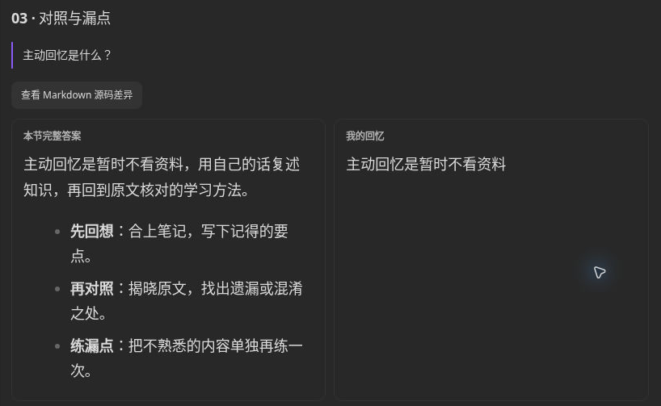
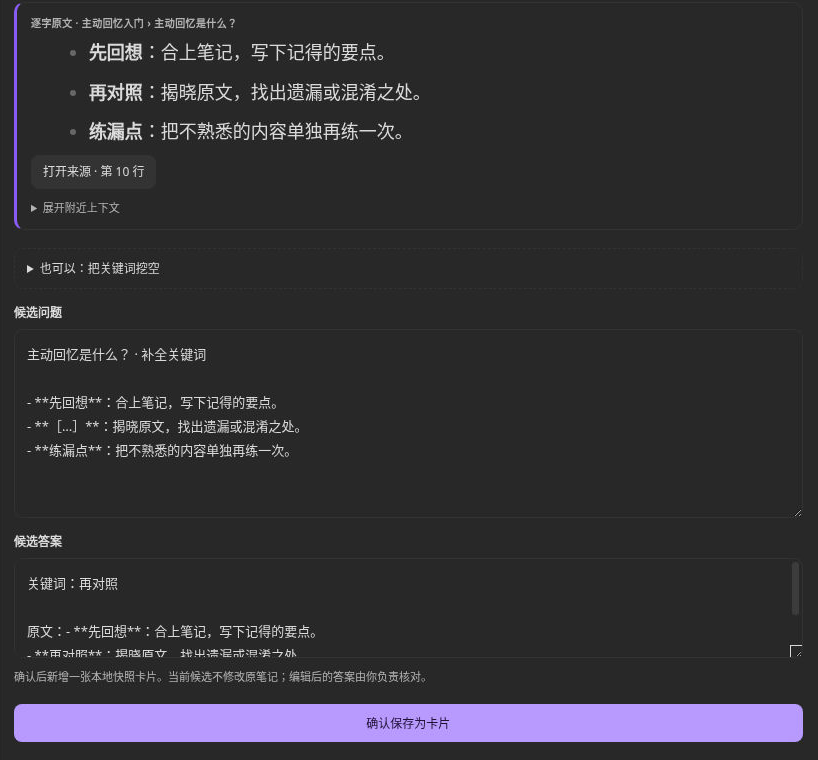

# 回想练习 · Passage Practice

把 Obsidian 笔记变成日常回忆练习：看题目、回想、揭晓原文，再把容易忘的内容做成卡片。

适合用笔记备考、学习课程或积累专业知识的人。中文界面，练习在侧栏完成；仅支持桌面版。当前版本 **1.3.0**，使用本地规则，无需 API Key。

## 四种学习方式

### 段落复习：记住一节内容

以最底层标题作题目，标题下的完整一节作参考答案，不按空行拆题。先回忆，再点「揭晓并对照」核对；可以记下漏点，只练漏掉的部分，或把本节制成卡片。没有标题的笔记也能按全文练习，还可以在编辑器中选一段文字单独练。

先遮住原文，在侧栏写下记得的内容。

揭晓后，把完整答案和自己的回忆放在一起核对。

### 大纲回忆：记住知识结构

看父节点，回忆它有哪些直属子分支，然后逐项揭晓、继续深入下一层。支持 Markdown 多级标题和缩进列表，适合复习章节框架、分类与步骤；不自动总结正文，也不读取图片思维导图。

### 问答卡片：安排间隔复习

正面是问题，背面是答案。揭晓后自己选择「忘了／困难／记住了／轻松」，插件据此安排下次复习，不自动判分。

用「插入卡片标记」把问答保存到笔记，或「新建快照卡片」独立保存。快照不会随原文修改而更新。「管理卡片」支持按状态、类型、来源筛选与搜索，也能跨页选择、核对后批量暂停或恢复；暂停不会清除已有进度。

按来源筛选卡片，再选择需要暂停或恢复的项目。

### 知识提炼：找到值得制卡的内容

从笔记的定义、列表和标题段落中整理候选，附带原文与来源。打开「预览与编辑」，核对上下文、适用条件和答案，再确认保存为卡片。候选由规则生成，可能遗漏内容或提出不合适的问题，需要人工检查。

核对候选原文后，选择关键词生成挖空草稿，确认问题与答案再保存。

## 按自己的范围练习

「学习范围」可选当前笔记、文件夹、标签或整个知识库；文件夹包含子目录，父标签包含子标签。

- **选词挖空**：把本节制成卡片，或打开候选预览，选择或输入原文关键词生成挖空草稿，检查后保存；代码和公式不会自动挖空
- **继续上次**：回到相同学习范围，可继续上次小节或大纲节点；来源已变化时需重新选择
- **保留学习成果**：段落对照后可保存新的复习记录，卡片评分会保存为复习进度

## 安装与第一次练习

需要 Obsidian 桌面版 1.6.6 或以上。目前未上架社区插件市场，可手动安装：

1. 从本仓库下载 `main.js`、`manifest.json`、`styles.css`
2. 在你的知识库中创建 `.obsidian/plugins/passage-practice/`，将三个文件放在这个文件夹内
3. 重启 Obsidian，在「设置 → 第三方插件」中启用 Passage Practice
4. 打开一篇笔记，点击左侧「回想练习」图标，选择「当前笔记 → 段落复习」
5. 选一个标题，写下回忆，再点「揭晓并对照」

升级前先备份并关闭插件，替换上述三个文件，保留原有 `data.json` 和 `practice-location.json`（如有）。

## 备份与恢复

在「问答卡片 → 备份与恢复」导出 JSON。恢复时先预览再确认，只合并缺失项，冲突保留本地版本。备份含卡片内容与已记录的复习进度，不包含原笔记，请同时备份 Obsidian 知识库。

## 许可

[MIT License](LICENSE) · [第三方声明](THIRD_PARTY_NOTICES.md)
